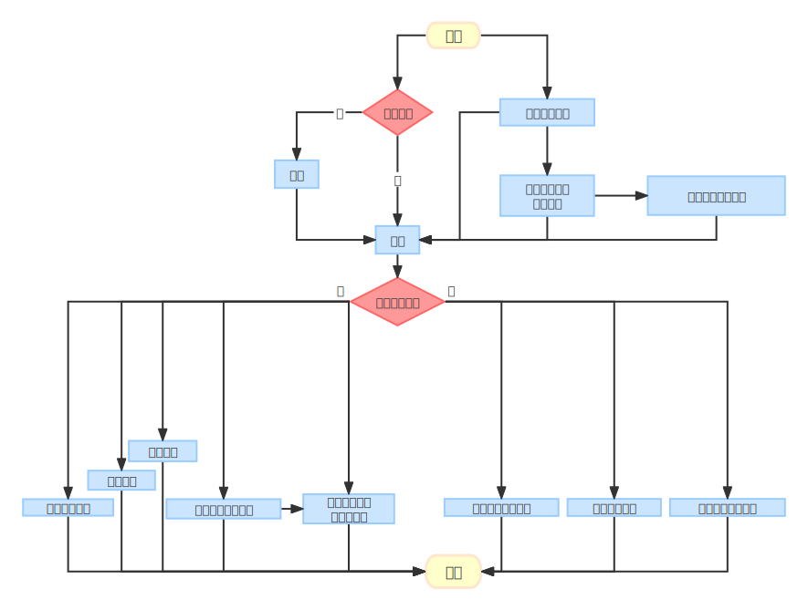
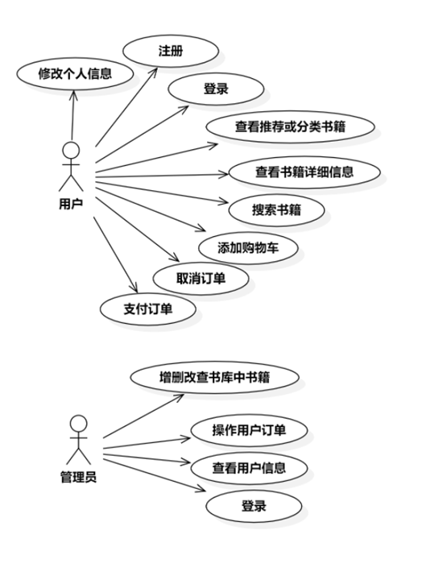
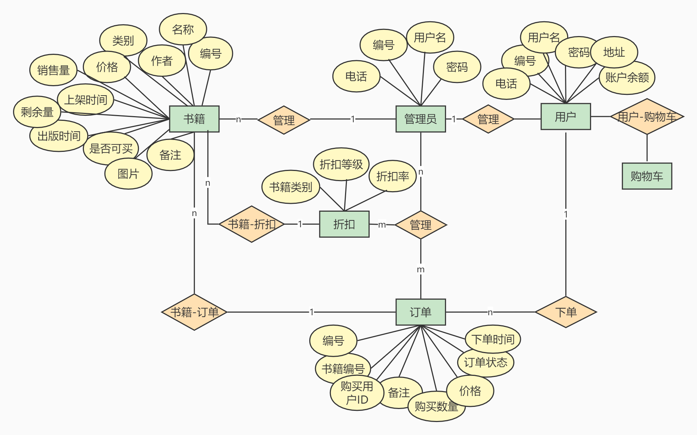
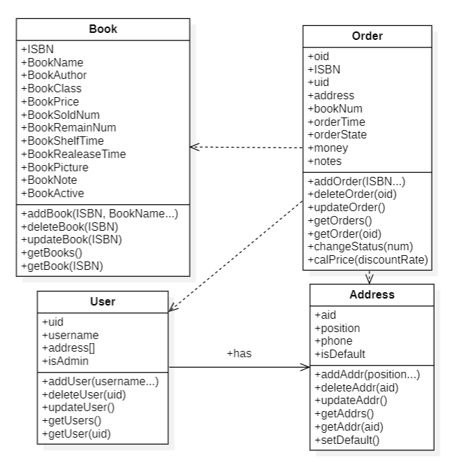

<center><strong><p style="font-size:46px">数据库原理综合课程设计</p></strong></center>
<center><strong><p style="font-size:46px">实验报告</p></strong></center>


<center><strong><p style="font-size:25px">题目：网上书店系统</p></strong></center>
<center><strong><p style="font-size:25px">组长：71120130昝崇崇</p></strong></center>
<center><strong><p style="font-size:25px">组员：71120126罗茂林</p></strong></center>
<center><strong><p style="font-size:25px">组员：71120113谢瀛增</p></strong></center>
<center><strong><p style="font-size:25px">组员：61520407牛露</p></strong></center>
<center><strong><p style="font-size:25px">指导教师： 徐立臻</p></strong></center>
<center><strong><p style="font-size:25px">起止时间： 2022/11/1——2022/12/11</p></strong></center>
<center><strong><p style="font-size:25px">设计地点： 南京</p></strong></center>

<div style="page-break-after:always;"></div>

## 一、需求分析

### 1. 项目概述

​       为了提高对数据库的理解与使用，根据现实生活中存在的网上书店场景，本小组构建了一个网上书店，以直观体验数据库在开发中的操作与使用。项目的基本内容如下：

​        用户可以浏览相关网页以查看店中书籍的相关信息，亦可自行搜索想要的书籍或者按照书籍类别查看某类图书。用户注册并登录个人账号后即可将心仪书籍加入购物车，可自行选择是否加入订单进行支付，`若未发货`，用户可取消订单。另外，用户可进行修改个人信息等操作。

​        系统将图书按照类别进行分类，将推荐与类别展示于导航栏，以便用户选择。

​        管理员可对书店书库中的书籍进行查找、增加、删除或者修改书籍的信息，亦可以处理用户请求，对用户的订单进行查询、修改或删除。`管理员能查看用户的非隐私信息，以便管理员进行一些相关操作。`

### 2. 功能需求分析

####  2.1 项目模块功能概览

<style>   
    table td,table th {     text-align:center;     vertical-align:middle;   } 
    table tr:odd{  background:#faa; } 
</style>
<table border='1'>  
    <tr>  
        <th>模块名称</th><th>功能概览</th>
    </tr> 
    <tr>  
        <td rowspan='9'>用户模块</td><td>注册</td>
    </tr> 
        <tr><td>登录</td> </tr> 
        <tr><td>查看推荐或分类书籍</td> </tr> 
        <tr><td>修改个人信息</td> </tr> 
        <tr><td>查看书籍详细信息</td> </tr> 
        <tr><td>搜索书籍</td> </tr> 
        <tr><td>添加购物车</td> </tr> 
        <tr><td>支付订单</td> </tr> 
        <tr><td>取消订单</td> </tr> 
    <tr>  
        <td rowspan='4'>管理员模块</td><td>增删改查书库中书籍</td>
    </tr> 
    <tr>  <td>操作用户订单</td></tr> 
    <tr>  <td>查看用户信息</td></tr> 
    <tr>  <td>登录</td></tr> 
</table>


#### 2.2 项目总体流程图



#### 2.3 项目总体用例图



#### 2.4 需求详细说明

##### 2.4.1 用户模块

| ID         | A2411                                                        |
| ---------- | :----------------------------------------------------------- |
| 用例名称   | 登录                                                         |
| 父用例ID   | 无                                                           |
| 主要执行者 | 用户                                                         |
| 前置条件   | 无                                                           |
| 事件流     | a.选择登录 <br/>b.在密码输入框内输入密码  <br/>c.点击登录按钮登录 |
| 可选事件流 | 无                                                           |
| 异常事件流 | a.用户不存在，提示“用户不存在”<br/>b.用户密码输入错误，提示“用户名或者密码错误”(防止多次恶意试错用户密码)<br/>c.输入的用户名或者密码为空，提示“表单项不能为空” |
| 后置条件   | 登录成功，根据用户类型跳转到首页，或者后台管理页面           |

| ID         | A2412                                                        |
| ---------- | :----------------------------------------------------------- |
| 用例名称   | 修改个人信息                                                 |
| 父用例ID   | 无                                                           |
| 主要执行者 | 用户                                                         |
| 前置条件   | 无                                                           |
| 事件流     | a.选择个人中心 <br/>b.在个人信息表单可修改密码，默认收件地址等个人信息<br/>c.点击确认进行修改 |
| 可选事件流 | 无                                                           |
| 异常事件流 | 无                                                           |
| 后置条件   | 修改成功，弹出提示信息                                       |

| ID         | A2413                                                        |
| ---------- | :----------------------------------------------------------- |
| 用例名称   | 注册                                                         |
| 父用例ID   | 无                                                           |
| 主要执行者 | 用户                                                         |
| 前置条件   | 无                                                           |
| 事件流     | a.选择注册 <br/>b.输入密码、用户名并确认密码<br/>c.点击确认进行注册 |
| 可选事件流 | 无                                                           |
| 异常事件流 | a.用户名已经存在则提示用户修改用户名                         |
| 后置条件   | 注册成功，弹出登录界面                                       |

| ID         | A2414                                    |
| ---------- | :--------------------------------------- |
| 用例名称   | 查看推荐或者分类书籍                     |
| 父用例ID   | 无                                       |
| 主要执行者 | 用户                                     |
| 前置条件   | 无                                       |
| 事件流     | a.用户点击导航栏中想要的类别按钮         |
| 可选事件流 | 无                                       |
| 异常事件流 | 无                                       |
| 后置条件   | 页面从首页跳转到推荐或者某分类的书籍页面 |

| ID         | A2415                            |
| ---------- | :------------------------------- |
| 用例名称   | 查看书籍详细信息                 |
| 父用例ID   | 无                               |
| 主要执行者 | 用户                             |
| 前置条件   | 无                               |
| 事件流     | a.点击图书列表中的某一本书的卡片 |
| 可选事件流 | 无                               |
| 异常事件流 | 无                               |
| 后置条件   | 跳转至该书籍详细信息页面         |

| ID         | A2416                                                        |
| ---------- | :----------------------------------------------------------- |
| 用例名称   | 搜索书籍                                                     |
| 父用例ID   | 无                                                           |
| 主要执行者 | 用户                                                         |
| 前置条件   | 无                                                           |
| 事件流     | a.在顶部导航栏中用户可以通过书名作者或者ISBN号对书籍进行搜索 |
| 可选事件流 | 无                                                           |
| 异常事件流 | 无                                                           |
| 后置条件   | 跳转至搜索结果页面                                           |

| ID         | A2417                              |
| ---------- | :--------------------------------- |
| 用例名称   | 添加购物车                         |
| 父用例ID   | 无                                 |
| 主要执行者 | 用户                               |
| 前置条件   | 无                                 |
| 事件流     | a.用户点击某本书添加至购物车的按钮 |
| 可选事件流 | 无                                 |
| 异常事件流 | 无                                 |
| 后置条件   | 弹出”添加成功“的消息提示           |

| ID         | A2418                        |
| ---------- | :--------------------------- |
| 用例名称   | 取消订单                     |
| 父用例ID   | 无                           |
| 主要执行者 | 用户                         |
| 前置条件   | 无                           |
| 事件流     | a.选择想要取消的订单点击取消 |
| 可选事件流 | 无                           |
| 异常事件流 | 无                           |
| 后置条件   | 提示”订单取消成功“           |

| ID         | A2419                        |
| ---------- | :--------------------------- |
| 用例名称   | 支付订单                     |
| 父用例ID   | 无                           |
| 主要执行者 | 用户                         |
| 前置条件   | 无                           |
| 事件流     | a.用户确认订单无误后点击确认 |
| 可选事件流 | 无                           |
| 异常事件流 | 无                           |
| 后置条件   | 提示”支付成功“               |

##### 2.4.2 管理员模块

| ID         | A2420                                                        |
| ---------- | :----------------------------------------------------------- |
| 用例名称   | 登录                                                         |
| 父用例ID   | 无                                                           |
| 主要执行者 | 管理员                                                       |
| 前置条件   | 无                                                           |
| 事件流     | a.选择登录 <br/>b.在密码输入框内输入密码  <br/>c.点击登录按钮登录 |
| 可选事件流 | 无                                                           |
| 异常事件流 | a.用户不存在，提示“用户不存在”<br/>b.用户密码输入错误，提示“用户名或者密码错误”(防止多次恶意试错用户密码)<br/>c.输入的用户名或者密码为空，提示“表单项不能为空” |
| 后置条件   | 登录成功，根据用户类型跳转到首页，或者后台管理页面           |

| ID         | A2421                                                        |
| ---------- | :----------------------------------------------------------- |
| 用例名称   | 增删改查书库中书籍                                           |
| 父用例ID   | 无                                                           |
| 主要执行者 | 管理员                                                       |
| 前置条件   | 无                                                           |
| 事件流     | a.在图书列表页面，点击增加按钮，录入相应的图书信息添加图书<br/>b.在图书列表页面，点击删除按钮，删除相应图书<br/>c.搜索框中根据ISBN或书名或作者搜索图书<br/>d.点击图书列表某一具体表项，弹出该书籍的信息表单，管理员即可修改表单信息，并按确认键确认修改结束 |
| 可选事件流 | 无                                                           |
| 异常事件流 | 无                                                           |
| 后置条件   | 为完成的相应操作弹出操作成功的提示信息                       |

| ID         | A2422                                                        |
| ---------- | :----------------------------------------------------------- |
| 用例名称   | 操作用户订单                                                 |
| 父用例ID   | 无                                                           |
| 主要执行者 | 管理员                                                       |
| 前置条件   | 无                                                           |
| 事件流     | a.通过查看用户列表或者搜索用户名找到某个用户<br/>b.进入该用户的订单信息表单进行修改，并按确认键确认 |
| 可选事件流 | 无                                                           |
| 异常事件流 | 无                                                           |
| 后置条件   | 提示修改成功                                                 |

| ID         | A2423                                                        |
| ---------- | :----------------------------------------------------------- |
| 用例名称   | 查看用户信息                                                 |
| 父用例ID   | 无                                                           |
| 主要执行者 | 管理员                                                       |
| 前置条件   | 无                                                           |
| 事件流     | a.通过查看用户列表或者搜索用户名找到某个用户<br/>b.点击该用户表项即可查看该用户的信息 |
| 可选事件流 | 无                                                           |
| 异常事件流 | 无                                                           |
| 后置条件   | 提示修改成功                                                 |

### 3. 非功能需求分析

- **系统应当遵循的技术标准**

  数据命名的规则遵循《ECMAScript》中相关的规定。

- **软、硬件环境标准**

  本系统采用B/S架构。

- **接口/协议标准**

  本系统通过HTTP协议实现web端和服务器之间的数据通信。

- **用户界面标准**

  界面应进行美工优化，确保是用户友好的。

- **软件质量**

  **1）正确性** 系统必须交易能够被正确处理，数据库应能做到遵循ACID准则

  **2）健壮性** 系统应能够正常运行，不易崩溃

  **3）易用性** 界面应采用图形化操作方式，便于用户或管理员操作

## 二、系统设计

### 1. 系统架构


本项目采用**B/S架构**进行系统的开发设计。

与C/S架构只有两层不同的是，**B/S架构有三层**，分别为：

**第一层表现层**：主要完成用户和后台的交互及最终查询结果的输出功能，即browser。

**第二层逻辑层**：主要是利用服务器完成客户端的应用逻辑功能，即web服务器。

**第三层数据层**：主要是接受客户端请求后独立进行各种运算，即数据库服务器。

**B/S架构的优点：**

> 1、客户端无需安装，有Web浏览器即可。 
> 2、BS架构可以直接放在广域网上，通过一定的权限控制实现多客户访问的目的，交互性较强。 
> 3、BS架构无需升级多个客户端，升级服务器即可。可以随时更新版本，而无需用户重新下载。

**B/S架构的缺点：**

> 1、在跨浏览器上，BS架构不尽如人意。 
> 2、表现要达到CS程序的程度需要花费不少精力。 
> 3、在速度和安全性上需要花费巨大的设计成本，这是BS架构的最大问题。 
> 4、客户端服务器端的交互是请求-响应模式，通常需要刷新页面，这并不是客户乐意看到的。（在Ajax风行后此问题得到了一定程度的缓解）

### 2.  数据库设计 

#### 2.1 E-R图



#### 2.2 全局模式图


#### 2.3 表及其字段说明

以下表格根据ER图构造，充分考虑了设计的合理性，也考虑了数据库设计的范式原则。

##### 2.3.1 Inventory书籍信息表

| 字段名          | 类型         | 备注                               |
| --------------- | :----------- | ---------------------------------- |
| BookID          | varchar(30)  | 书籍ISBN序号；主键；不可空         |
| BookName        | varchar(50)  | 书籍名称；不可空                   |
| BookAuthor      | varchar(50)  | 书籍作者；不可空                   |
| BookClass       | varchar(20)  | 书籍类别；外键；不可空             |
| BookPrice       | float        | 书籍价格；不可空                   |
| BookSoldNum     | int          | 书籍销售量；不可空                 |
| BookRemainNum   | int          | 书籍剩余量；不可空                 |
| BookShelfTime   | datetime     | 书籍上架时间；不可空               |
| BookReleaseTime | datetime     | 书籍出版时间；不可空               |
| BookActive      | bit          | T:书籍可销售; F:书籍已下架; 不可空 |
| BookPicture     | varchar(255) | 书籍相关图片地址；可以为空         |
| BookNote        | text         | 书籍简介；可空                     |

属性都是原子的，有唯一主键，不存在对非主键的依赖，没有传递依赖，因而是符合 3NF 的。

##### 2.3.2 Uers用户信息表

| 字段名      | 类型        | 备注                  |
| ----------- | ----------- | --------------------- |
| MemberID    | int         | 用户ID；主键；不可空  |
| Password    | varchar(50) | 用户密码；不可空      |
| MemberName  | varchar(50) | 用户名；不可空        |
| MemberPhone | varchar(11) | 用户号码；不可空      |
| IsManager   | bit         | T: 管理员 F：普通用户 |
| Balance     | float       | 账户余额              |

属性都是原子的，有唯一主键，不存在对非主键的依赖，没有传递依赖，因而是符合 3NF 的。

##### 2.3.3 Address用户地址信息表

| 字段名   | 类型         | 备注                   |
| -------- | ------------ | ---------------------- |
| MemberID | int          | 用户ID；主键；不为空   |
| Address  | varchar(255) | 用户地址；主键；不为空 |

##### 2.3.4 Orders订单信息表

| 字段名     | 类型        | 备注                                      |
| ---------- | ----------- | ----------------------------------------- |
| OrderID    | int         | 订单号；主键；不可空                      |
| BookID     | varchar(30) | 书籍ISBN序号；外键；不为空                |
| MemberID   | int         | 购买用户ID；外键；不为空                  |
| OrderNum   | int         | 订购书籍数目；不为空                      |
| OrderTime  | datetime    | 下订单时间；不为空                        |
| OrderState | int         | 订单状态：0未处理 1已接受 2已拒绝 3已完成 |
| TotalPrice | float       | 下订单时书籍总价格；不为空                |
| OrderNote  | text        | 订单备注；可以为空                        |

属性都是原子的，有唯一主键，不存在对非主键的依赖，没有传递依赖，因而是符合 3NF 的。

##### 2.3.5 Discount书籍折扣信息表

| 字段名       | 类型        | 备注                       |
| ------------ | ----------- | -------------------------- |
| BookClass    | varchar(50) | 书籍类别；主键；不为空     |
| DiscountNum  | int         | 满足折扣的书籍数量；不为空 |
| DiscountRate | float       | 折扣率；不为空             |

#### 2.4并发控制

为了保证对数据库操作的正确性，我们使用**事务**来实现数据库的**并发控制**。例如，用户购买了一本图书，那么需要查询这本书是否有库存，从库存表中删除，在订单表中增加一项。该操作需要时原子性才能保证用户下单成功一定会有书籍。当用户购买多本书籍且有大量用户同时购买时，情况会变得复杂。因此，对数据库的操作采用事务处理，能够满足如下的ACID准则：

- 原子性(Atomic action)：事务执行时，要么不做，要么全做。
- 保持一致性(Consistency preservation)：事务对数据库的作用应使数据库从一个一致状态转变到另一个一致状态。而一致状态指数据库数据满足完整性约束。
- 隔离性(Isolation)：如果多个事务并发执行，应像各个事务独立执行一样。并发控制就是为了保证事务的隔离性。
- 持久性(Durability)：一个成功执行的事务对数据库的影响应是持久的，即使数据库因故障而受到破坏，DBMS也应该能够恢复。

MySQL使用了InnoDB存储引擎，InnoDB 存储引擎提供事务的隔离级别有READ UNCOMMITTED（未提交读）、READ COMMITTED（提交读）、REPEATABLE READ（可重复读） 和 SERIALIZABLE（可串行化）。通常会给表增加**行锁**。因此，使用MySQL的 BEGIN, ROLLBACK, COMMIT来实现并发控制，保证数据一致性。

- **BEGIN** 开始一个事务
- **ROLLBACK** 事务回滚
- **COMMIT** 事务确认

例如：

```SQL
mysql> CREATE TABLE test_table( id int(5)) engine=innodb;  # 创建数据表，指定innodb引擎
Query OK, 0 rows affected (0.02 sec)
 
mysql> select * from test_table;
Empty set (0.01 sec)
 
mysql> begin;  # 开始事务
Query OK, 0 rows affected (0.00 sec)
 
mysql> insert into test_table value(1);  # 插入
Query OK, 1 rows affected (0.01 sec)
 
mysql> insert into test_table value(2);  # 插入
Query OK, 1 rows affected (0.00 sec)
 
mysql> commit; # 提交事务
Query OK, 0 rows affected (0.01 sec)
 
mysql>  select * from test_table;
+------+
| id   |
+------+
| 1    |
| 2    |
+------+
2 rows in set (0.01 sec)
 
mysql> begin;    # 开始事务
Query OK, 0 rows affected (0.00 sec)
 
mysql>  insert into test_table values(6);  # 插入
Query OK, 1 rows affected (0.00 sec)
 
mysql> rollback;   # 回滚
Query OK, 0 rows affected (0.00 sec)
 
mysql>   select * from test_table;   # 因为回滚所以数据没有插入
+------+
| id   |
+------+
| 1    |
| 2    |
+------+
2 rows in set (0.01 sec)
 
mysql>
```

#### 2.5数据库操作

展示了对数据库几种主要的操作类型，相似类型的语句不进行展示

**查找所有名称包含"Database"关键字的书籍的详细信息**

```SQL
SELECT *
FROM Inventory
WHERE BookName='.*D|database.*'; 
```

**增加一条书籍信息记录**

```SQL
INSERT INTO Inventory ( [BookID], [BookName], [BookAuthor], [BookClass], [BookPrice], [BookSoldNum], [BookRemainNum], [BookShelfTime], [BookReleaseTime], [BookActive], [BookPicture] )
VALUES ('ISBN 978-7-121-06010-6', '数据库系统教程（第2版）（上册）', '王能斌', '计算机科学', 34.00, 100, 10, '2014-2', '2008-5', 1, './bookcover/10008956.png');
```

**进货，更新库存**

**注意：**读取书籍数量并更新是一个原子操作，若读取之后得到数量BookRemainNum，但是此时发生了书籍卖出的情况，再对之前的BookRemainNum进行增加就发生了数据不一致，剩余书籍的数量凭空多出了。

```SQL
BEGIN;
SELECT BookRemainNum From Inventory WHERE BookID='ISBN 978-7-121-06010-6';
UPDATE Inventory SET BookRemainNum=BookRemainNum+50 WHERE BookID='ISBN 978-7-121-06010-6';
COMMIT;
```

**用户充值**

```SQL
BEGIN;
SELECT Balance FROM Users WHERE MemberID='abaaba';
UPDATE Users SET Balance = Balance+200 WHERE MemberID='abaaba';
COMMIT;
```

**用户购买n本书**

```SQL
BEGIN;
DECLARE bookPrice float; 
DECLARE bookRemainNum int;
DECLARE bookClass varchar(50);
DECLARE total float;
SELECT BookRemainNum INTO bookRemainNum, BookPrice INTO bookPrice, BookClass INTO bookClass
From Inventory 
WHERE BookID='ISBN 978-7-121-06010-6';
IF BookRemainNum<n then
	ROLLBACK;
ELSE 
	DECLARE rate float;  
	SELECT IFNULL(DiscountRate, 1.) INTO rate FROM Discount WHERE BookClass=bookClass AND n>=DiscountNum;
	total = n*bookPrice*rate
	UPDATE Inventory SET BookRemainNum=BookRemainNum-n WHERE BookID='ISBN 978-7-121-06010-6';
	INSERT INTO Orders ( [OrderID], [BookID], [MemberID], [OrderNum], [OrderTime], [OrderState], [BookPrice], [OrderNote] )
	VALUES (101, 'ISBN 978-7-121-06010-6', 'abaaba', n, '2022-12-03-17-10', '未处理', total)
END IF;
DECLARE balance float;
SELECT Balance INTO balance FROM Users WHERE MemberID='abaaba'
IF balance < total THEN
	ROLLBACK;
ELSE 
	UPDATE Users SET Balance = balance-total WHERE MemberID='abaaba'
	COMMIT;
END IF;
```

### 3. 类设计



系统整体的类图如上。

类图的设计与数据库的关系设计比较相似，但又略有不同，类图**更面向实际开发**，后期实际开发时会根据不同的用户权限去调用不同的函数。

**Book class：**

| 函数名     | 参数             | 返回值       | 说明                                     |
| ---------- | ---------------- | ------------ | ---------------------------------------- |
| addBook    | ISBN,BookName... | bool是否成功 | （admin可调用）添加图书                  |
| deleteBook | ISBN             | bool是否成功 | （admin可调用）删除图书                  |
| updateBook | ISBN,BookName... | bool是否成功 | （admin可调用）修改图书信息              |
| getBooks   | 无               | array        | 获取所有图书信息，以数组形式返回         |
| getBook    | ISBN             | array        | 获取某一本图书的详细信息，以数组形式返回 |

**User class：**

| 函数名     | 参数        | 返回值       | 说明                                            |
| ---------- | ----------- | ------------ | ----------------------------------------------- |
| addUser    | username... | bool是否成功 | 添加用户，注册即为添加新用户                    |
| deleteUser | uid         | bool是否成功 | 注销用户                                        |
| updateUser | username... | bool是否成功 | 修改用户信息                                    |
| getUsers   | 无          | array        | （admin可调用）获取所有用户信息，以数组形式返回 |
| getUser    | uid         | array        | 获取某个用户的详细信息，以数组形式返回          |

**Order class：**

| 函数名       | 参数         | 返回值       | 说明                                            |
| ------------ | ------------ | ------------ | ----------------------------------------------- |
| addOrder     | ISBN...      | bool是否成功 | 添加新订单                                      |
| deleteOrder  | oid          | bool是否成功 | 取消订单                                        |
| updateOrder  | address...   | bool是否成功 | 修改订单信息                                    |
| getOrders    | 无           | array        | （admin可调用）获取所有订单信息，以数组形式返回 |
| getOrder     | oid          | array        | 获取某一个订单的详细信息，以数组形式返回        |
| changeStatus | num          | bool是否成功 | 修改订单状态，0购物车中，1未付款，2已付款       |
| calPrice     | discountRate | int订单总额  | 根据折扣计算订单的总额                          |

**Address class：**

| 函数名     | 参数        | 返回值             | 说明                                   |
| ---------- | ----------- | ------------------ | -------------------------------------- |
| addAddr    | position... | bool是否成功       | 添加地址                               |
| deleteAddr | aid         | bool是否成功       | 删除地址                               |
| updateAddr | position... | bool是否成功       | 修改地址信息                           |
| getAddrs   | 无          | array              | 获取所有地址信息，以数组形式返回       |
| getAddr    | aid         | array              | 获取某一地址的详细信息，以数组形式返回 |
| setDefault | 无          | bool是否为默认地址 | 设置为默认地址                         |

## 三、系统实现

几段文字，非重点

截几张目录结构的图

## 四、系统测试

一堆截图

## 五、源代码

github地址并附上压缩包

## 六、实验总结

